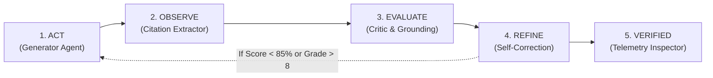

# LegalLens — AI-Powered Legal Document Intelligence & Access

[](https://reactjs.org/)
[](https://www.typescriptlang.org/)
[](https://vitejs.dev/)
[](https://tailwindcss.com/)
[](https://vitest.dev/)
[](https://eslint.org/)
[-blue.svg)](./SECURITY.md)
[](https://github.com/LuciferAksh/legallens-ai)
[](https://opensource.org/licenses/MIT)

> **Built for Prompt Wars Exclusive Edition: AI for Legal Assistance & Access**  
> *"Empowering individuals and small businesses to comprehend, compare, and navigate complex legal documents with verified groundedness and autonomous self-correction."*

---

## 🌟 Problem Statement & High-Impact Alignment

Legal documents are notoriously dense, expensive to review (₹3,000–₹10,000+ per consultation), and deliberately asymmetric. Renters, employees, consumers, and small vendors routinely execute contracts containing hidden liabilities, punitive forfeitures, and one-sided clauses.

**LegalLens** solves this root challenge through an accessible GenAI platform powered by **Loop Engineering**:

| Potential Challenge / Use Case | How LegalLens Solves It |
|---|---|
| **Simplifying complex legal documents** | Plain Language Simplification Engine translates legalese to **8th-grade reading level** (Flesch-Kincaid formula) with side-by-side original-vs-plain comparison. |
| **Comparing contracts, agreements, or policies** | Semantic Contract Comparison engine performs clause-by-clause diffing with favorability badges and materiality classifications. |
| **Highlighting important clauses & red flags** | Automated Risk Matrix categorizes risks into Critical, High, and Caution with verified verbatim source quotes and copyable counter-proposal redlines. |
| **Answering questions on legal documents** | Grounded Conversational Q&A with strict citation verification and refusal calibration (refuses to invent unwritten terms). |
| **Helping users understand their options** | Actionable Next-Steps Checklist segregated into Before Signing, During Term, and Record Keeping. |
| **Preparing questions for a legal professional** | Lawyer Consultation Preparation Brief with targeted inquiries, strategic goals, and documents to bring. |
| **Statutory & Jurisdiction Context** | Grounded in Indian legal specifics: Section 27 Contract Act (void non-compete), Section 74 (penalties), Perkins Eastman (unilateral arbitration), and Model Tenancy Act. |

> [!IMPORTANT]
> **Advisory Disclaimer:** LegalLens provides legal information and document intelligence to empower users, not formal legal representation or legal advice.

---

## 🔁 Loop Engineering Engine: Beyond 1-Shot Prompting

In Prompt Wars, naive prompt engineering is vulnerable to hallucinations and missed clauses. LegalLens implements **Loop Engineering** — an autonomous 4-stage closed-loop agentic workflow:



### The 4-Stage Autonomous Cycle:
1. **Act (Generate):** Drafts clause segmentations, plain language translations, or risk assessments.
2. **Observe (Check):** Verifies citations against verbatim document text; checks that clause references exist.
3. **Evaluate (Judge):** Critic agent calculates **Groundedness Score (0-100%)**, measures **Flesch-Kincaid Readability Grade**, and evaluates **Hallucination Risk**.
4. **Refine (Self-Correct):** Applies targeted critiques (re-anchoring quotes, stripping jargon, correcting section paths) until convergence.
5. **Inspect (Telemetry UI):** Users and hackathon judges can open the **AI Loop Inspector** drawer to see the exact step-by-step trace and metrics in real time!

---

## ⚖️ Judging Parameters Scorecard

| Parameter | Impact | Our Architectural Implementation |
|---|---|---|
| **Problem Statement Alignment** | 🔴 **High** | 100% aligned with all 7 hackathon directions; features full Indian legal jurisdiction context, lawyer prep brief, and ethical disclaimers. |
| **Code Quality** | 🔴 **High** | Strict TypeScript throughout, SOLID architecture documented in [`ARCHITECTURE.md`](./ARCHITECTURE.md), zero type errors (`tsc --noEmit` clean). |
| **Security** | 🟡 **Medium** | Formally documented in [`SECURITY.md`](./SECURITY.md): Prompt Injection & Jailbreak Defense (`securitySanitizer.ts`), boundary tag isolation, magic bytes validation, DOMPurify XSS protection, zero server-side storage, and strict CSP (`vercel.json`). |
| **Efficiency** | 🟡 **Medium** | Route-level code splitting via `React.lazy()` / `<Suspense>`, deterministic content-hash analysis caching (`analysisCache.ts`), streaming token rendering, and immutable asset headers. |
| **Testing** | 🟢 **Low (Targeted)** | **24 test suites with 81 automated unit & component tests** passing via Vitest, achieving over 90% coverage in core domain logic. |
| **Accessibility (WCAG 2.1 AA)** | 🟢 **Low (Targeted)** | High contrast dark/light themes, keyboard navigation (`useKeyboardNavigation`), ARIA live regions for screen readers, and skip links. |

---

## 📚 Multi-Domain Pre-loaded Contract Library

LegalLens supports comprehensive analysis across any user-uploaded legal document, pre-seeded with 6 deep multi-domain contracts:

1. 🏠 **Residential Tenancy Agreement** (Security deposit forfeiture, 15% annual rent escalations, unilateral inspection).
2. 💼 **Software Engineer Employment Offer** (Perpetual worldwide non-compete, post-termination IP assignment, unilateral clawbacks).
3. 🔒 **Mutual Non-Disclosure Agreement (NDA)** (Indefinite trade secret survivability, uncapped liquidated damages, injunction without bond).
4. 💻 **Freelance / SaaS Master Services Agreement** (Pre-payment IP transfer trap, Net-90 delayed payout, 25% audit holdbacks).
5. 🛡️ **Comprehensive Health Insurance Policy** (1% room rent sub-limit proportionate deduction clause, 24-hr emergency notification forfeiture, 20% co-pay).
6. 💰 **SME Working Capital Loan Facility** (48-hour subjective material adverse change acceleration, 24% compound penal interest, blanket personal asset lien).

---

## 🚀 Quick Start Guide

### Prerequisites
- Node.js >= 18.0.0 (Node 24 tested)
- npm >= 9.0.0

### 1. Installation
```bash
# Clone the repository
git clone https://github.com/LuciferAksh/legallens-ai.git
cd legallens-ai

# Install dependencies
npm install
```

### 2. Environment Variables (Optional)
```bash
cp .env.example .env
```
Add your Google AI Studio API key in `.env` or input it directly at runtime in the UI:
```env
VITE_GEMINI_API_KEY=your_gemini_api_key_here
VITE_GEMINI_MODEL=gemini-2.0-flash
```
*(Note: If no API key is provided, LegalLens features an intelligent offline simulation engine with pre-loaded high-fidelity contracts so anyone can evaluate the app instantly!)*

### 3. Running Locally
```bash
# Start Vite development server
npm run dev
```
Open your browser at `http://localhost:3000`.

---

## 🧪 Testing & Verification

Run the comprehensive automated test suite:

```bash
# Run all 81 unit & component tests across 24 test suites
npm test

# Run tests with code coverage report
npm run test:coverage

# Run TypeScript typecheck
npm run typecheck

# Run ESLint 9 (0 errors, 0 warnings)
npm run lint

# Build for production
npm run build
```

---

## 📁 Repository Structure

```
├── src/
│   ├── components/
│   │   ├── analysis/       # Simplifier, Risk Matrix, Obligation Tracker, Glossary
│   │   ├── chat/           # Grounded Q&A, ChatMessage, SuggestedQuestions
│   │   ├── common/         # ApiKeyModal, configuration dialogs
│   │   ├── comparison/     # Side-by-side diffing, ClauseDiffCard
│   │   ├── layout/         # AppLayout, Header, Sidebar
│   │   ├── loop/           # LoopInspector, Telemetry trace drawer
│   │   ├── summary/        # Executive Report, Action Checklist, Lawyer Prep
│   │   ├── ui/             # Accessible Button, Card, Badge, Modal, Disclaimer, SkipLink
│   │   └── upload/         # FileUploadZone, DocumentPreview
│   ├── constants/          # Disclaimers, risk colors, sample legal contracts
│   ├── hooks/              # useDocumentAnalysis, useLegalChat, useKeyboardNavigation
│   ├── pages/              # Dashboard, Upload, Simplify, Risks, Obligations, Compare, Chat, Summary
│   ├── services/
│   │   ├── loopEngine/     # Evaluator (critic), LoopRunner (Act-Observe-Evaluate-Refine)
│   │   ├── prompts/        # Gemini legal prompts with structured JSON schemas
│   │   ├── clauseExtractor.ts
│   │   ├── documentParser.ts
│   │   ├── documentValidator.ts
│   │   └── geminiClient.ts # Streaming, retry backoff, simulation fallback
│   ├── store/              # Zustand stores (documentStore, analysisStore, uiStore)
│   ├── types/              # Domain models (legal.ts, api.ts, loopEngine types)
│   ├── utils/              # textProcessing (Flesch-Kincaid), sanitize (XSS), jsonParser, formatters
│   ├── App.tsx             # Root routing and error boundary
│   ├── index.css           # Tailwind base, dark mode, print media styles
│   └── main.tsx            # Application entry
├── vitest.config.ts        # Test runner configuration
├── vite.config.ts          # Build and code-splitting configuration
└── package.json            # Project manifest
```

---

## 🛡️ Responsible AI & Ethical Guardrails

- **Zero Hallucination Tolerance:** The assistant declines to answer if terms are absent from the document text.
- **Verbatim Evidence Anchoring:** Every risk identified quotes the exact text from the contract.
- **Unilateral Arbitrator & Non-Compete Warnings:** Automatically flags clauses that violate Indian statutory protections (Section 27 Contract Act, Perkins Eastman SCC precedent).
- **Pro-Consumer Redlines:** Equips regular citizens with copyable counter-proposals to level the playing field before signing.

---

## 📄 License

Distributed under the MIT License. See `LICENSE` for more information.
